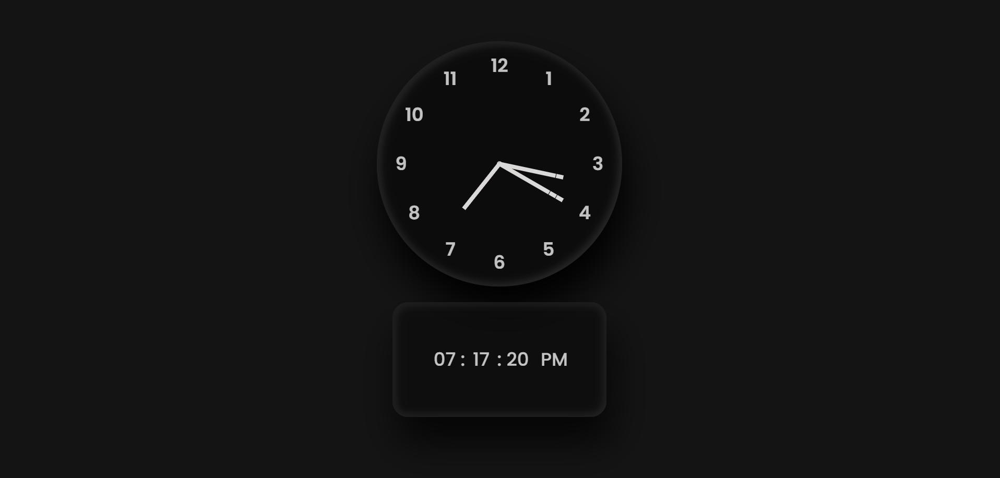

# Clock Project

A simple yet elegant clock project built using HTML, CSS, and JavaScript.

## Overview

This project is a digital clock that displays the current time in hours, minutes, and seconds. The clock is designed to be visually appealing, with a clean and modern interface. The project uses HTML for structuring the content, CSS for styling, and JavaScript for dynamic functionality.

## Features

- Displays the current time in hours, minutes, and seconds
- Features an analog clock face with hour, minute, and second hands
- Includes a digital display of the time in 12-hour format (AM/PM)
- Uses a modern and clean design

## Screenshot

## Live Preview

You can view the live version of the clock project.
## [View Live](https://basharkhan7776.github.io/Clock/)

## Technical Details

- **HTML**: Used for structuring the content and creating the clock face.
- **CSS**: Used for styling the clock face and digital display.
- **JavaScript**: Used for dynamic functionality, including updating the clock time and animating the clock hands.

## License

This project is licensed under the MIT License. See `LICENSE` for details.

## Contributing

Contributions are welcome! If you'd like to contribute to this project, please fork the repository and submit a pull request.

## Acknowledgments

- Font: Poppins, courtesy of Google Fonts
- Logo:  